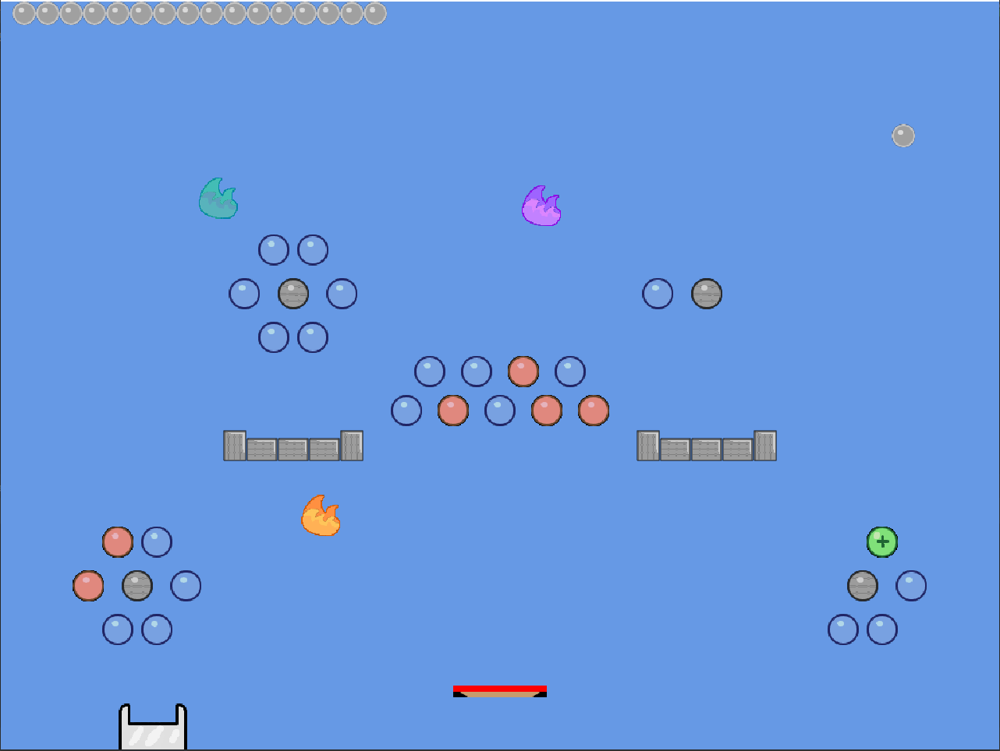

# Game project: Shadow Bounce
This project is to created a game called Shadow Bounce in Java platform.

## How the Game works

### Library
Besides standard libraries, this game uses a library created by Elanor McMurty, called Bagel. You will need to import `bagel.jar` to play the game.

Additional: [Bagel Functionalities](https://people.eng.unimelb.edu.au/mcmurtrye/bagel-doc/)

### Game components
Shadow Bounce consists of the following components:
#### Ball: Object that will be controlled by player to win the game.
  * Standard ball: destroys pegs upon touch.
  * Fire ball: destroy pegs upon touch, as well as its surrounding pegs (within 70 pixels).
#### Pegs: Has different colors. Each color has a different effect when touched.
  * Grey: Indestructible. Just there to block your way.
  * Blue: Standard color. Disappears upon contact with ball.
  * Red: Acts like Blue, but destroying it is compulsory to pass the level.
  * Green: Randomly transformed from a Blue after each turn. Pops up 2 more ball of the same type to both sides when touched.
#### Bonuses:
  * Fire: Appears every 1 out of 10 turns. Turns a standard ball into a fireball upon touch.
  * Bucket: Add a life for each ball that lands on it.
  
### Gameplay

#### Initial
* The game levels will be generated using `.csv` files, and will initially consists of the generated pegs. A fifth of the Blues will turn Red.
* You will have 20 lives.

#### How to play
* Choose a position on the screen. Click on the screen, and the ball will launch from the middle top of the screen (512,32) with its initial velocity pointing towards the clicked position (gravity applies).
* Ball will bounce off the pegs upon touch (some Breakout-themed here).
* A life is lost when ball is off-screen from the bottom.
* Goal is to clear all the Reds and advance to the next level until clearing them all.

## Extensions and improvements
 
 *The demo of the game with extension included*

### Improvements

#### Add lives left on screen to allow players to keep track of their progress.
  Lives will appear as balls on top-left corner of screen.
#### Handle simultaneous collisions
To make bouncing more efficient and logic.
  * *Verify that a ball can only hit a maximum of 2 pegs.*
  * *Collsion effect only applies to the ball for the peg that has bigger contact area.*
#### Handle grey peg collision
To avoid tangle.
  * *Discover the problem: Greys do not disappear, so they might be in contact with the ball multiple times, bouncing the ball back and forth due to the latter's smaller area. This can result in a tangle.*
  * *Solution: Only allows the Greys to affect the ball once upon touch. Make the effect available again only when ball has gotten out of contact.*
  
### Extensions
I found the original game a bit boring, so I added some more features.
#### Ball:
  * Laser ball: penetrate and destroy pegs upon touch.
#### Bonuses:
  * Laser: Appears every 1 out of 10 turns. Turns a standard ball into a laser ball upon touch.
  * Dark Matter: Sucks balls that falls into it (wordplay not intended).
  * Plate: Bounces the ball back to the game, can be moved using left & right keyboards, if you are too bored and wanted to play Breakout instead.
#### Gameplay:
  * Cheat codes added. Find it yourself! (Hint: to advance to the next round means that a new board window is opened)
  * **Level Generator: Create `.csv` customized level files to put into the game. Including detailed instructions.**
  
  *Demo of the level generator. I tried to draw a rocket, but it fails apparently *sighs *
